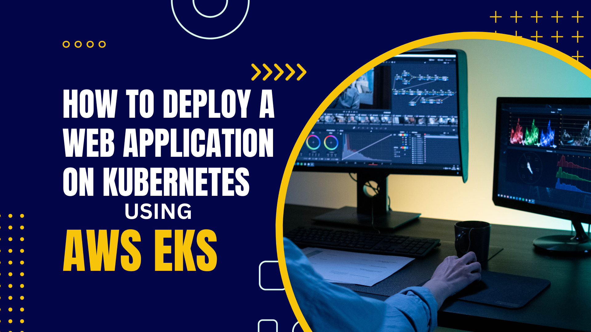
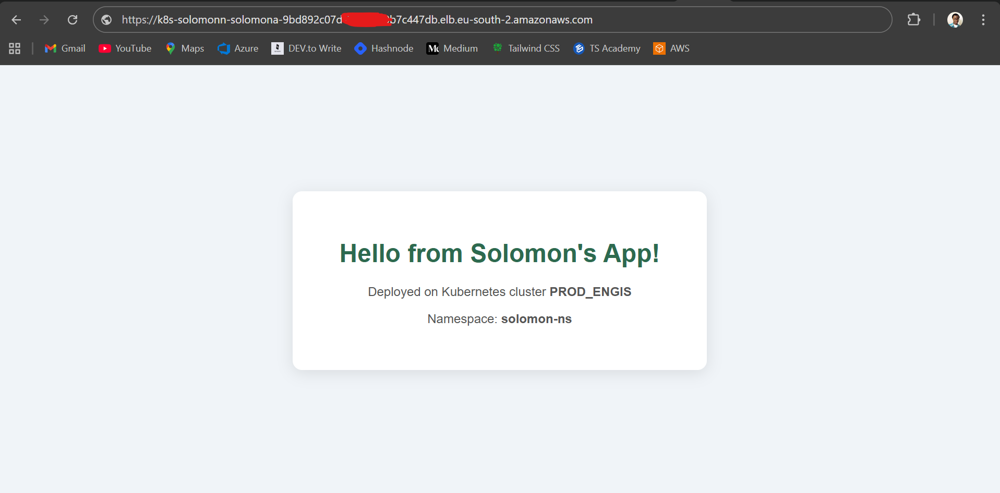

**How to Deploy a Web Application on Kubernetes Using AWS EKS**



One of the best ways to solidify your Kubernetes knowledge is to go beyond theory and actually deploy something to see how it works. In this post, I will walk you through on how I deployed a simple HTML web app on a live AWS EKS cluster, covering the full workflow from writing the manifest file to accessing the app.

---

**The Setup**

- Cloud Provider: AWS (eu-south-2 region)
- Cluster: EKS (production-grade cluster)
- Namespace: custom isolated namespace
- Web Server: nginx:alpine
- Deployment method: kubectl + YAML manifests

---

**Step 1 — Create a Dedicated Namespace**

Rather than deploying into the default namespace, I created a dedicated namespace to isolate the workload. This is a best practice in multi-team or multi-environment clusters as it provides logical separation and makes resource management cleaner.

```bash
kubectl create namespace solomon-ns
```

---

**Step 2 — Write the HTML Application**

I created a simple but clean HTML page as the application. Nothing fancy here. The goal was to focus on the deployment process, not the app itself.

---

**Step 3 — Write the Kubernetes Manifests**

The deployment YAML contained three Kubernetes resources:

- **ConfigMap** — stored the HTML file content so it could be injected into the container without needing a custom Docker image (This is the best practice, though.)
- **Deployment** — used the official `nginx:alpine` image with 2 replicas for availability, and mounted the ConfigMap as a volume into nginx's HTML directory
- **Service** — exposed the app externally using a `LoadBalancer` type service, which automatically provisioned an AWS Elastic Load Balancer (ELB)

Using `nginx:alpine` is a best practice for serving static content. It is lightweight, secure, and production-ready out of the box.

---

**Step 4 — Apply the Manifests**

```bash
kubectl apply -f k8s/app-server-deployment.yaml
```

Then verified the pods were healthy:

```bash
kubectl get pods -n solomon-ns
kubectl get svc -n solomon-ns
```

---

**Step 5 — Troubleshoot AWS Security Groups**

After the ELB provisioned successfully, the app wasn't reachable via the public DNS. When I tried to access it through the ELB URL, it showed an error `ERR_CONNECTION_TIMED_OUT` page. The root cause was the node group security group not having the correct inbound rules to allow traffic from the load balancer.

I fixed this by updating the inbound rules on the node security group to allow TCP traffic on the NodePort range `30000–32767` from the load balancer's security group. This is a security best practice, scoping the source to the LB security group rather than opening it to `0.0.0.0/0`.

---

**The Deployed App**



---

**Step 6 — Verified the App via Port Forwarding**

While resolving the networking issue, I used `kubectl port-forward` to confirm the application itself was running correctly:

```bash
kubectl port-forward svc/solomon-app-service 8080:80 -n solomon-ns
```

The app loaded perfectly on `http://localhost:8080`. This was to confirm that the Deployment, ConfigMap, and Service were all configured correctly. The issue was purely at the AWS networking layer, not the Kubernetes layer.

---

**Step 7 — Clean Up**

Once done, I pulled down all the resources cleanly with a single command:

```bash
kubectl delete namespace solomon-ns
```

Deleting the namespace cascades and removes all resources within it; pods, services, configmaps, everything. I also verified the ELB was removed from the AWS Console to avoid unnecessary costs.

---

**My Key Takeaways**

- Always use namespaces to isolate workloads
- ConfigMaps are a great way to inject static content without building custom images
- Security groups are often the first thing to check when an ELB is provisioned but unreachable
- `kubectl port-forward` is an invaluable tool for debugging services without exposing them publicly
- Always clean up cloud resources after testing to avoid surprise bills

---

*I'm actively building my Cloud and DevOps skills and working hands-on with Kubernetes, AWS EKS, and cloud-native tooling. I am open to new opportunities. Feel free to connect or reach out.*

# Kubernetes #DevOps #AWS #EKS #CloudNative #nginx #kubectl #LearningInPublic #OpenToWork
