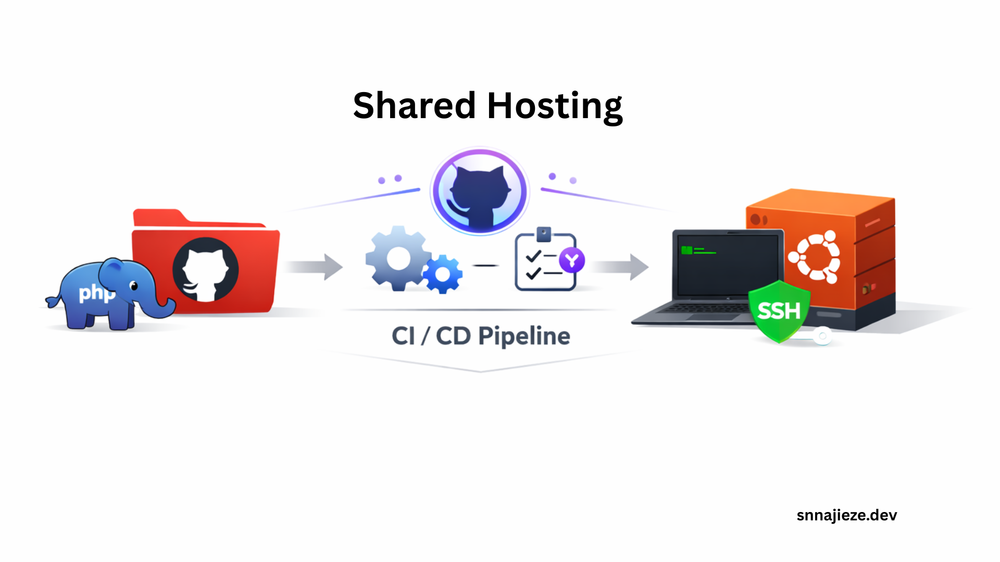
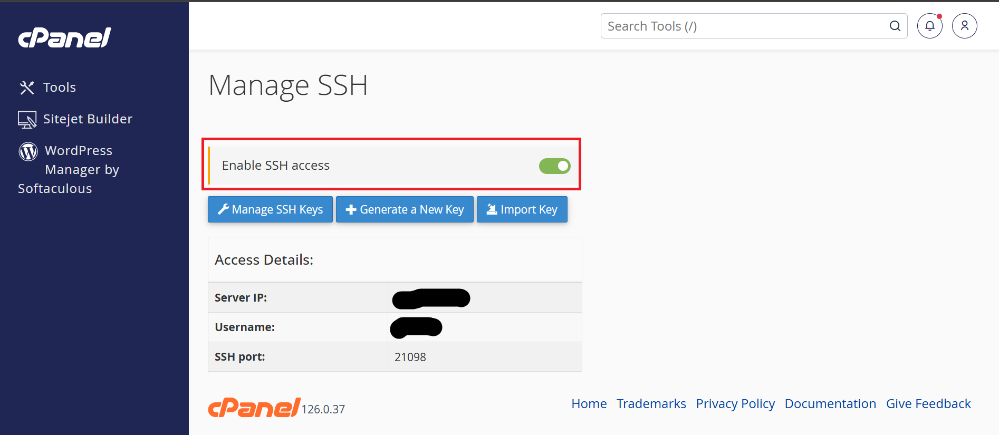
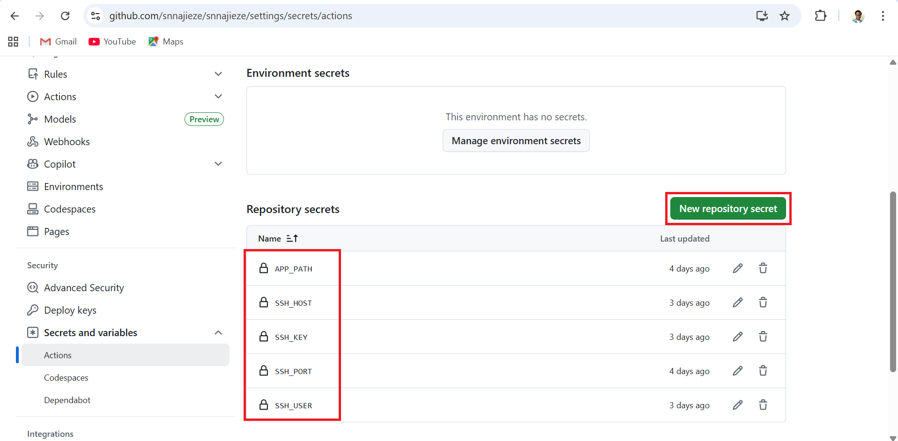
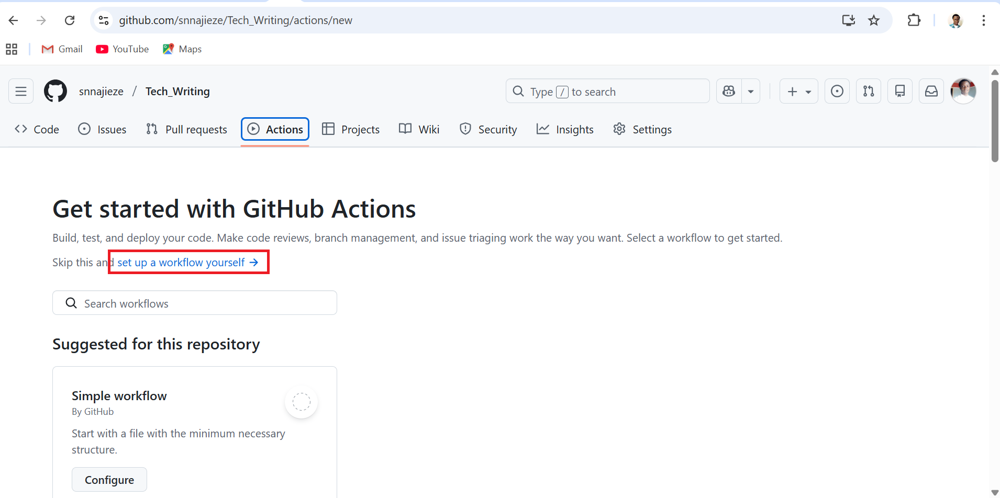

# CI/CD Is Not Only for the Cloud: Building a CI/CD Pipeline for Shared Hosting Using GitHub Actions



## Introduction: CI/CD Beyond Cloud Platforms

When people hear Continuous Integration and Continuous Deployment (CI/CD), they often think it’s something that only works on cloud platforms like AWS, Azure, or GCP, Kubernetes, EC2, containers, and all that.

But the truth is:

CI/CD is not made for the cloud alone. It is a workflow, and it can work anywhere, including shared hosting.

CI/CD pipelines are **not exclusive to cloud infrastructure**.
In this article, I will walk you through how I built a real **CI/CD pipeline** for a Laravel application deployed on **shared hosting (Namecheap)** using **GitHub Actions** + **SSH** + **rsync**, even with the limitations of traditional cPanel servers.

This guild is based on a **real-world deployment** on Namecheap shared hosting, highlighting challenges, fixes, and best practices.

---

## Why CI/CD on Shared Hosting?

Shared hosting is still very common for:

- Personal projects
- Small businesses
- MVPs
- Legacy systems

Yet most CI/CD tutorials completely ignore it.

### Common misconceptions

- “You need Kubernetes.”
- “You need Docker.”
- “You need AWS, Azure, or GCP.”

### Reality

- If you have SSH access, you can do CI/CD
- GitHub Actions works anywhere
- Automation is about process, not infrastructure

---

## The Stack We Used

- Laravel application
- Shared hosting (Namecheap)
- SSH access enabled
- GitHub Actions
- rsync for deployment

- *No Docker.*
- *No cloud VM.*
- *No managed pipelines.*

---

## The Main Idea

The idea is simple:

- Push code to GitHub
- GitHub Actions runs a workflow
- The workflow connects to the server via SSH
- Only changed files are synced to the server
- The application files update automatically

---

## What We Are Building

- **CI/CD pipeline** using **GitHub Actions**
- Deployment to **shared hosting (Namecheap)**
- Laravel application (You can deploy any application)
- Secure deployment using **SSH**
- Zero downtime friendly using rsync for deployment

---

## Why CI/CD on Shared Hosting Is Challenging

Shared hosting environments are restrictive by design and functionality, unlike cloud and VPSs, where you have full control. Some of the difficulties we encountered include:

### 1. Limited Server Control

- No root access and sudo
- No system-wide package installation
- Restricted SSH configuration
- Cannot run npm for JavaScript packages

### 2. SSH Authentication Issues

- SSH keys generated on the server vs local machine
- Incorrect key formats are causing `libcrypto` errors
- Permission errors (`Permission denied (publickey)`)

### 3. Risk of Accidental File Deletion

- Using `rsync --delete` without exclusions
- Losing `.env` and storage files

---

## Step-by-Step: Setting Up CI/CD for Shared Hosting

### Step 1: Generate SSH Key on the Server

SSH is not enabled on Namecheap cPanel by default, and you need to enable it to be able to follow this guide.

From the cPanel, under **Exclusive for Namecheap Customers**, click on **Manage Shell** then you will enable the SSH as shown below:


You can either access the server terminal from your local machine using SSH or directly from cPanel **Terminal**.

Log into your shared hosting CLI and run:

```bash
ssh-keygen -t ed25519 -f github_actions_key -N ""
```

- Do **not** set a passphrase. GitHub actions will not work with passphrase/password.
- The above bash command will create two files:
  - `github_actions_key` (private key)
  - `github_actions_key.pub` (public key)
- The files will be stored in the **.ssh** folder on cPanel:

**Note:** You can generate the SSH keys from cPanel UI, but it requires you add a password, which will not work with GitHub actions.

To confirm that the key works, download the key to a folder on your local machine and try to SSH to your server from the same folder where the key is stored. If it does not require a password, then the GitHub action will have the permission to access your server.

---

### Step 2: Add Public Key to Authorized Keys

Append the public key:

```bash
cat ~/.ssh/github_actions_key.pub >> ~/.ssh/authorized_keys
chmod 600 ~/.ssh/authorized_keys
chmod 700 ~/.ssh
```

This will authorize the keys to be accessed from GitHub actions.

---

### Step 3: Add Private Key and other variables to GitHub Secrets

In your GitHub repository:
**Settings → Secrets and variables → Actions → New Repository Secret**



| Name | Value |
|----|------|
| APP_PATH | project_path |
| SSH_HOST | yourdomain.com or server IP |
| SSH_KEY | *(contents of github_actions_key)* |
| SSH_PORT | custom_ssh_port(eg 21098) |
| SSH_USER | hosting_username |

**Note:** Use **Repository Secrets**, not Environment secrets. Paste the **private key**, not the *.pub* file.

---

## Step 4: Create GitHub Actions Workflow for Shared Hosting Deployment

Normally, GitHub detects and presents suggested workflows automatically according to your codebase. In this sample, we will go with the *"set up a workflow yourself"* link.



This is shown only when you have not created any workflow on the repository. If you have a workflow already, it will show the workflow runs and the button to create another workflow.

Clicking the link will create a file named ".github/workflows/main.yml" which will contain the YAML script of GitHub actions.

### Sample Workflow steps explained

Let us go through and explain the workflow steps accordingly.

### Workflow Name & Trigger

```yaml
name: Laravel CI/CD (Namecheap SSH)

on:
  push:
    branches:
      - main
```

This section defines the name of the workflow and when it should run.
This block **on.push.branches.main** tells GitHub to automatically trigger this workflow whenever new code is pushed to the main branch.

In a company setting with many repository branches, the workflow will not be triggered if a push is made to any branch other than main. That way, it prevents unwanted changes from being deployed.

### Job Definition & Runner

```yaml
jobs:
  deploy:
    runs-on: ubuntu-latest
```

This section defines a job named deploy and specifies the environment it runs in, and jobs is the top-level key where all workflow jobs are declared.

### Checking Out the Repository

```yaml
steps:
  - name: Checkout code
    uses: actions/checkout@v4
```

This step pulls the latest version of your repository into the GitHub Actions runner, and the **steps** define a sequence of actions executed within the job.

### Setting Up PHP Environment

```yaml
- name: Setup PHP
    uses: shivammathur/setup-php@v2
    with:
      php-version: "8.2"
      extensions: mbstring, xml, curl, zip, bcmath
      coverage: none
```

This step prepares the PHP runtime required to run the Laravel application. At this point, if you are creating a workflow for an application developed in another language, then this will be different.

### Deploying Files to the Server (Rsync over SSH)

```yaml
- name: Upload project via rsync (SSH)
    uses: burnett01/rsync-deployments@7.1.0
    with:
      switches: -az --exclude=".env" --exclude="storage/**" --exclude="bootstrap/cache/**" --exclude=".git" --exclude=".htaccess"
      path: ./
      remote_path: ${{ secrets.APP_PATH }}
      remote_host: ${{ secrets.SSH_HOST }}
      remote_user: ${{ secrets.SSH_USER }}
      remote_key: ${{ secrets.SSH_KEY }}
      remote_port: ${{ secrets.SSH_PORT }}
```

This step deploys the application to the server using rsync over SSH.
**rsync** transfers only changed files, while **--exclude** prevents sensitive and environment files from being deleted, files like .env, .htaccess, etc.

**path** specifies the local project directory to sync while **remote_*...** values are pulled from GitHub Secrets.

### Running Laravel Commands on the Server

```yaml
- name: Run Laravel commands on server
    uses: appleboy/ssh-action@v1.0.3
    with:
      host: ${{ secrets.SSH_HOST }}
      username: ${{ secrets.SSH_USER }}
      key: ${{ secrets.SSH_KEY }}
      port: ${{ secrets.SSH_PORT }}
      script: |
        cd ${{ secrets.APP_PATH }}
        php artisan migrate --force
        php artisan optimize:clear
        php artisan config:cache
        php artisan route:cache
        php artisan view:cache
```

This step connects to the production server via SSH and executes essential Laravel maintenance commands. It finalizes the deployment by ensuring the application is up to date, optimized, and production ready after each release.

### The full CI/CD workflow for shared hosting (`.github/workflows/main.yml`)

```yaml
name: Laravel CI/CD (Namecheap SSH)

on:
  push:
    branches:
      - main

jobs:
  deploy:
    runs-on: ubuntu-latest

    steps:
      - name: Checkout code
        uses: actions/checkout@v4

      - name: Setup PHP
        uses: shivammathur/setup-php@v2
        with:
          php-version: "8.2"
          extensions: mbstring, xml, curl, zip, bcmath
          coverage: none

      - name: Upload project via rsync (SSH)
        uses: burnett01/rsync-deployments@7.1.0
        with:
          switches: -az --exclude=".env" --exclude="storage/**" --exclude="bootstrap/cache/**" --exclude=".git" --exclude=".htaccess"
          path: ./
          remote_path: ${{ secrets.APP_PATH }}
          remote_host: ${{ secrets.SSH_HOST }}
          remote_user: ${{ secrets.SSH_USER }}
          remote_key: ${{ secrets.SSH_KEY }}
          remote_port: ${{ secrets.SSH_PORT }}

      - name: Run Laravel commands on server
        uses: appleboy/ssh-action@v1.0.3
        with:
          host: ${{ secrets.SSH_HOST }}
          username: ${{ secrets.SSH_USER }}
          key: ${{ secrets.SSH_KEY }}
          port: ${{ secrets.SSH_PORT }}
          script: |
            cd ${{ secrets.APP_PATH }}
            php artisan migrate --force
            php artisan optimize:clear
            php artisan config:cache
            php artisan route:cache
            php artisan view:cache
```

---

## Why rsync Is Ideal for Shared Hosting CI/CD

- Transfers **only changed files**
- Faster deployments
- Lower server load
- Avoids full folder replacement

### Does rsync delete everything on the server?

No, unless you use `--delete`.

If you use:

```bash
rsync -az --delete
```

Files **not present in the repo** will be removed on the server.

**Recommended:**

- Avoid `--delete` on shared hosting
- And use exclusions (`--exclude`) very carefully

---

## Best Practices for CI/CD on Shared Hosting

### Security

- Never commit `.env`
- Use SSH keys, not passwords
- Test SSH manually first
- Restrict SSH ports
- Exclude sensitive files
- Do not hard code variables and secrets, use **Repository Secrets**

### Deployment

- Deploy only changed files using **rsync**
- Backup before major changes
- Exclude runtime directories and files

### Stability

- Build locally or in CI when possible
- Monitor file permissions after deploy

---

## Bonus

## You may need .htaccess file for Laravel application

When you host a Laravel application on shared hosting, by default, the file lists will show when someone visits your domain name. To prevent this and direct users to your application home page, use the **.htaccess** file to set the rules.

### Correct Laravel Rewrite Rule

```apache
<IfModule mod_rewrite.c>
    RewriteEngine On
    RewriteRule ^(.*)$ public/$1 [L]
</IfModule>
```

Use the rule above inside the .htaccess file. It will direct traffic to the public folder of the Laravel application instead of listing the directory contents. The .htaccess file should be in the parent folder of the application.

## Problem with npm

If you are deploying an application that needs you to run `npm` command to bundle your app, it is advisable you run `npm run build` on your local machine and remove the build folder from `.gitignore` file so it can be pushed to GitHub and then be deployed to your server.

---

## Key Takeaways

- CI/CD is **not limited to cloud platforms**
- Shared hosting can support CI/CD with proper setup
- GitHub Actions + SSH + rsync is a powerful combo
- Understanding hosting limitations is critical
Shared hosting can absolutely support professional CI/CD workflows if you design them properly.

---

## Conclusion

CI/CD pipelines are about **automation**, not infrastructure based. With the right approach, even shared hosting environments can benefit from modern DevOps workflows.

If you're running Laravel on shared hosting, CI/CD is absolutely achievable, and it saves time from having to update your server's files after each change constantly.

After you have followed the above guide, whenever you push your code to the main branch, GitHub Action will automatically deploy your code to your shared host server.

---

**Keywords:** CI/CD shared hosting, GitHub Actions shared hosting, Laravel CI/CD, deploy Laravel without cloud, CI/CD Namecheap
